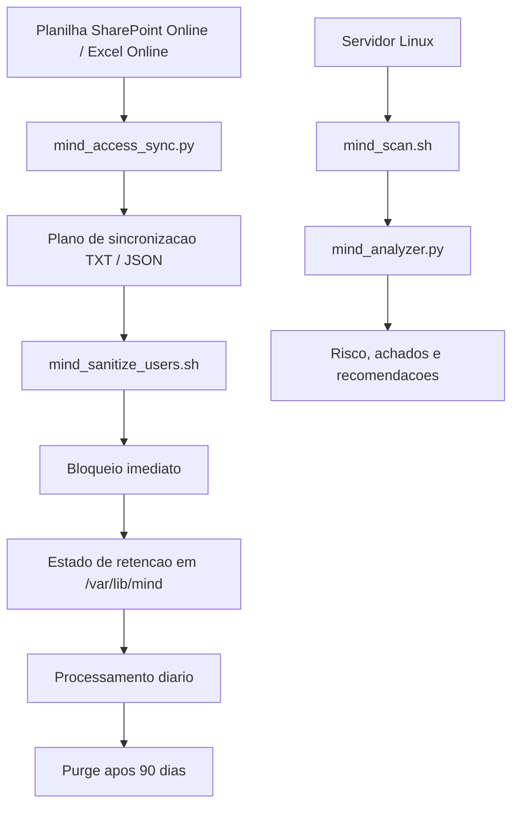
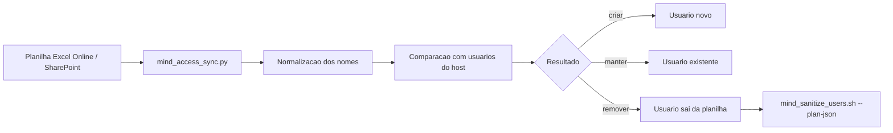

# MIND Access Governance

Base de automacao para governanca de acessos Linux e sanitizacao do ambiente.

O projeto combina dois blocos complementares:

- gestao de acessos a partir de uma planilha SharePoint Online / Excel Online;
- sanitizacao operacional do ambiente Linux com varredura, analise e offboarding.

## Objetivo

Estruturar acessos e acoes de sanitizacao em fluxos legiveis, auditaveis e
passiveis de automacao futura. A ideia central e reduzir tarefas manuais,
manter evidencias em TXT e JSON e criar uma base confiavel para integracao com
IA interna e, futuramente, com Ansible.

## Arquitetura

### 1. Gestao de acessos

Arquivo principal:

```bash
mind_access_sync.py
```

Funcao:

- ler um workbook `.xlsx` publicado no SharePoint Online;
- normalizar nomes para logins Linux;
- comparar a planilha com os usuarios existentes no servidor;
- gerar um plano de `criar`, `manter` e `remover`;
- produzir TXT e JSON para auditoria e automacao.

### 2. Sanitizacao do ambiente

Arquivos principais:

- `mind_scan.sh`
- `mind_analyzer.py`
- `mind_sanitize_users.sh`

Funcao:

- o sensor coleta evidencias do servidor;
- o analisador classifica riscos e achados;
- o sanitizador executa bloqueio, remocao e retencao com estado persistente.

## Fluxos

### Fluxo de acessos

```text
Planilha Excel Online / SharePoint
        |
        v
mind_access_sync.py
        |
        v
Normalizacao e comparacao
        |
        v
Plano de sincronizacao
        |
        v
TXT + JSON
```

### Fluxo de sanitizacao

```text
Servidor Linux
        |
        v
mind_scan.sh
        |
        v
mind_analyzer.py
        |
        v
mind_sanitize_users.sh
        |
        v
Bloqueio, remocao, retencao e evidencia
```

## Fluxo Visual

### Visao geral do projeto



### Fluxo de acessos



### Fluxo de sanitizacao


## Modelo de operacao

- A planilha do SharePoint funciona como interface visual de cadastro.
- O codigo do projeto consome o workbook apenas quando e necessario validar ou
  gerar plano.
- O sanitizador suporta fluxo manual por CSV legado, fluxo automatizado via
  JSON da planilha e rotina diaria de retencao para purge apos 90 dias.

## Beneficios

- Centralizacao da fonte de verdade para acessos.
- Visualizacao e edicao grafica no Excel Online.
- Evidencias persistentes para auditoria e rastreabilidade.
- Separacao clara entre planejamento e execucao.
- Base pronta para futuras playbooks e integracoes.

## Limitacoes e cuidados

- O planner de acessos nao executa alteracoes sozinho.
- A politica de 90 dias depende de estado persistente no servidor.
- O acesso ao SharePoint pode exigir sincronizacao local do workbook.
- A sanitizacao continua sendo uma operacao sensivel e requer validacao.

## Planilha de exemplo

O repositório inclui uma planilha base com estes nomes:

- João Paulo Araujo
- Douglas Michel Da Silva
- Julyana Silva da Rocha
- Odair Batista Gonçalves dos Santos
- Carlos Roitman Amaral Maceno

Recriacao da planilha:

```bash
python3 mind_access_sync.py --create-template --template-path acessos_exemplo.xlsx
```

## Uso rapido

Gerar plano de acessos:

```bash
python3 mind_access_sync.py --workbook acessos_exemplo.xlsx --sheet Acessos
```

Executar a sanitizacao:

```bash
sudo ./mind_scan.sh
python3 mind_analyzer.py /var/log/mind/mind_scan_HOST_DATA.json
sudo ./mind_sanitize_users.sh --plan-json /var/log/mind/mind_access_sync_*.json --apply
```

## Evolucao futura

- integracao direta com SharePoint Online;
- playbook Ansible para aplicacao controlada;
- historico de acessos e retencao;
- perfis de risco por tipo de servidor;
- conexao com base de conhecimento da IA interna.

## Estrutura

```text
.
├── mind_access_sync.py
├── acessos_exemplo.xlsx
├── mind_scan.sh
├── mind_analyzer.py
├── mind_sanitize_users.sh
├── README.md
├── README_acesso_excel.md
├── README_OPERACIONAL.md
├── README_sanitize_users.md
└── .gitignore
```
