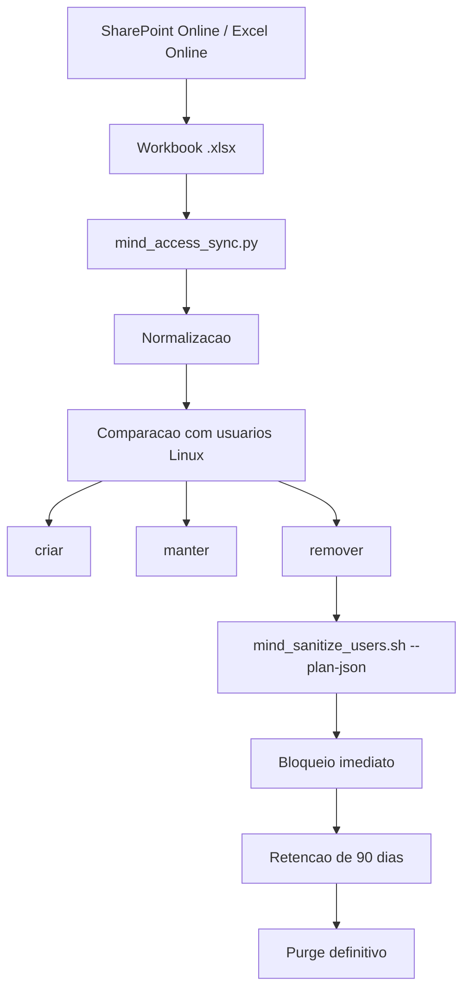

# MIND Access Governance via Excel

Documento de referencia para a camada de governanca de acessos baseada em
planilha SharePoint Online / Excel Online.

## Proposta

A planilha Excel funciona como interface visual de cadastro e auditoria para a
equipe Linux. O workbook continua sendo um arquivo `.xlsx` comum, editavel no
Excel Desktop ou no Excel Online, enquanto o projeto usa Python apenas para ler
e transformar os dados em planos de sincronizacao.

## Estrutura da planilha

Colunas recomendadas:

| Coluna | Uso |
| --- | --- |
| `nome_completo` | Nome do colaborador ou titular do acesso |
| `usuario_linux` | Login Linux desejado |
| `status` | `ativo` ou `inativo` |
| `grupo` | Grupo de acesso |
| `ticket` | Numero do chamado ou aprovacao |
| `observacao` | Campo livre de apoio |

## Comportamento do planner

O arquivo `mind_access_sync.py`:

- le o workbook `.xlsx`;
- identifica a planilha de acessos;
- normaliza nomes e logins;
- compara o cadastro com os usuarios existentes no servidor;
- gera um plano com tres destinos principais: `criar`, `manter` e `remover`;
- produz TXT e JSON para auditoria e uso futuro.

Importante:

- o planner de acessos nao executa bloqueio, remocao ou retencao por conta
  propria;
- a politica de bloqueio imediato e purge apos 90 dias pertence ao fluxo de
  sanitizacao do ambiente;
- o arquivo serve como fonte de verdade para o cadastro, nao como mecanismo de
  execucao.

## Beneficios

- visualizacao grafica para a equipe no SharePoint;
- edicao centralizada e controlada;
- menos dependencia de CSV manual;
- maior rastreabilidade para auditoria;
- base adequada para evoluir para automacao com Ansible.

## Limites

- depende de workbook bem estruturado;
- exige definicao de governanca sobre edicao e aprovacao;
- pode precisar de sincronizacao local caso o servidor nao acesse o SharePoint
  diretamente;
- nao substitui a rotina de sanitizacao do ambiente.

## Exemplo de planilha

O projeto inclui o arquivo `acessos_exemplo.xlsx` com os registros:

- João Paulo Araujo
- Douglas Michel Da Silva
- Julyana Silva da Rocha
- Odair Batista Gonçalves dos Santos
- Carlos Roitman Amaral Maceno

Recriacao:

```bash
python3 mind_access_sync.py --create-template --template-path acessos_exemplo.xlsx
```

## Fluxo de uso

```bash
python3 mind_access_sync.py --workbook acessos_exemplo.xlsx --sheet Acessos
```

O resultado esperado e um conjunto de evidencias em TXT e JSON que podem ser
revisadas manualmente ou consumidas por automacoes posteriores.

## Fluxo Visual



## Evolucao futura

- conexao direta com SharePoint Online;
- historico de alteracoes por periodo;
- validacoes adicionais de campo;
- integracao com playbooks Ansible;
- uso do diff de acessos como entrada para a IA interna.
