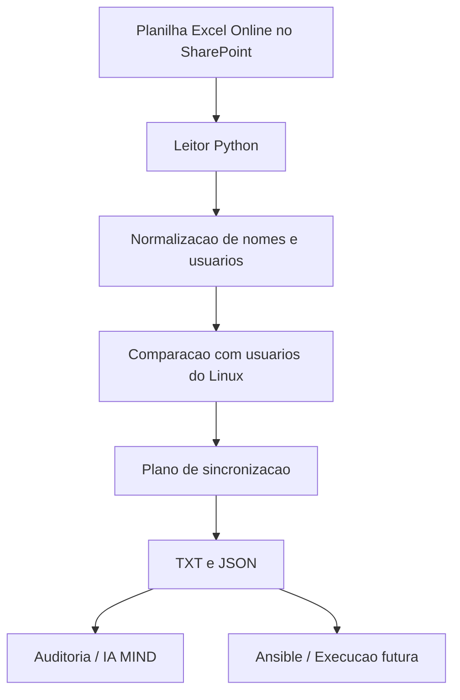

# MIND Access Governance via Excel

Este documento descreve a nova direcao do projeto: sair do modelo baseado em
CSV e usar uma planilha Excel Online, hospedada no SharePoint, como fonte
central de acessos.

O exemplo do repositório usa o arquivo `acessos_exemplo.xlsx`.

## Ideia central

A planilha vira a fonte de verdade da operacao.

Em vez de manter um arquivo manual com a lista de usuarios, a equipe Linux
mantem uma planilha controlada, e um processo automatizado transforma essa
planilha em um plano de sincronizacao para os servidores Linux.

O fluxo busca:

- centralizar a administracao de acessos;
- reduzir manipulacao manual de arquivos;
- gerar trilha de auditoria em TXT e JSON;
- preparar a integracao futura com Ansible;
- manter a MIND alimentada com dados estruturados.

## Fluxo proposto

```text
Planilha Excel Online (SharePoint)
        |
        v
Leitor Python
        |
        v
Normalizacao de nomes / usuarios Linux
        |
        v
Comparacao com usuarios do servidor
        |
        v
Plano de sincronizacao (criar / manter / remover)
        |
        v
TXT + JSON para auditoria, IA e Ansible
```

## Como a planilha deve funcionar

A planilha deve ser simples e ter a equipe Linux como unica responsavel pela
edicao.

Sugestao de colunas:

| Coluna | Uso |
| --- | --- |
| `nome_completo` | Nome do colaborador ou titular do acesso |
| `usuario_linux` | Login Linux desejado. Se vazio, o sistema pode tentar derivar |
| `status` | `ativo` ou `inativo` |
| `grupo` | Grupo de acesso, se houver |
| `ticket` | Numero do chamado ou aprovacao |
| `observacao` | Informacoes extras |

Regras sugeridas:

- `ativo` significa que o acesso deve existir no servidor.
- `inativo` significa que o acesso nao deve permanecer autorizado.
- `usuario_linux` sempre pode sobrescrever a derivacao automatica.
- A equipe Linux valida a planilha antes de qualquer execucao real.

## O que o script novo faz

O arquivo `mind_access_sync.py`:

- le o workbook `.xlsx`;
- normaliza os nomes;
- identifica quais contas precisam ser criadas, mantidas ou removidas;
- ignora usuarios protegidos do sistema;
- gera TXT e JSON para auditoria;
- prepara a saida para um futuro consumo por Ansible.

Exemplo de uso:

```bash
python3 mind_access_sync.py --workbook acessos.xlsx --sheet Acessos
```

Para recriar a planilha de exemplo:

```bash
python3 mind_access_sync.py --create-template --template-path acessos_exemplo.xlsx
```

## Nomes de exemplo

O workbook de exemplo contém estes registros:

- João Paulo Araujo
- Douglas Michel Da Silva
- Julyana Silva da Rocha
- Odair Batista Gonçalves dos Santos
- Carlos Roitman Amaral Maceno

## Fluxograma em Mermaid



## Fase de transicao

O script `mind_sanitize_users.sh` pode continuar existindo como legado durante
a migracao, mas a nova direcao do projeto passa a ser a planilha Excel como
entrada principal.

## Beneficio arquitetural

Esse modelo e melhor do que o CSV solto porque:

- reduz risco de alteracao manual fora do processo;
- permite controle de acesso pela propria plataforma Microsoft 365;
- facilita auditoria de quem alterou o cadastro;
- deixa o dado pronto para automacao e governanca;
- separa a fonte de verdade da execucao.
